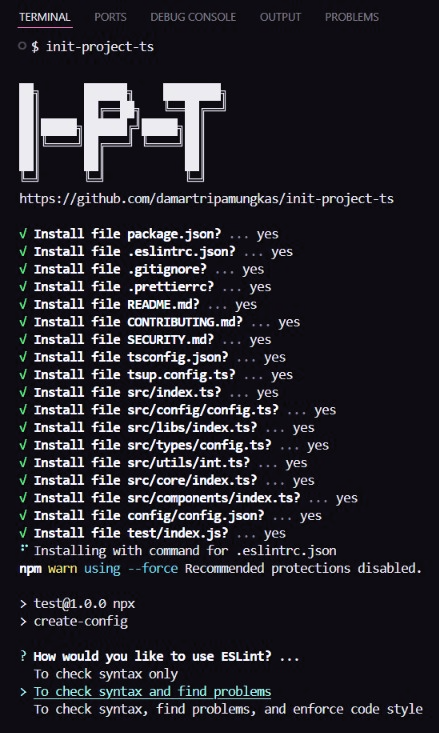

<h1 align="center">
    INIT-PROJECT-TS
</h1>

<p align="center">
  
  
  <a href="#">
    
  </a>
  
  
  
  <a href="#">
    
  </a>
</p>

### 📖 Description :

This package is made for those who want to initialize a typescript project without having to create files and install packages 1 by 1.

### 💻 Step to install :

```
npm install -g init-project-ts
```

### ✏️ Example :



### 🧾 Pre-Requisistes :

```
- node.js / bun.js / deno.js
- (optional) typescript
- (optional) commonJS
- (optional) ESM
```

### 📝 License :

Licensed see [here](./LICENSE).
